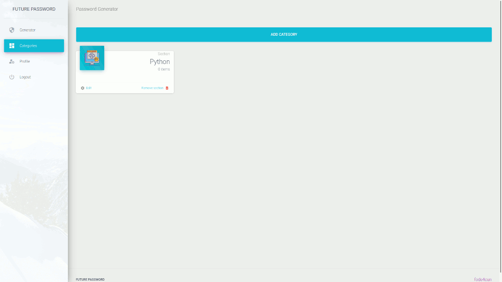

# PASSWORD MANAGER WITH DJANGO

The app allows us to generate different length passwords with additional params
(lower case, upper case,  punctuation, numbers).
We provide an authentication system for creating different categories and
definition passwords by categories.

## Demo

- [https://futurepassword.herokuapp.com/](https://futurepassword.herokuapp.com/ "Futurepassword")

### Preview

